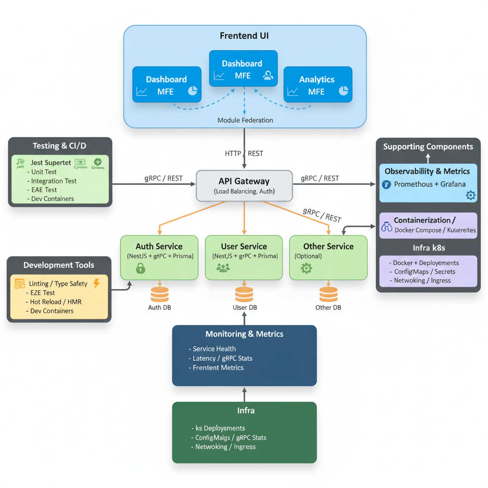

# FhyMatrix [ID](./README.md)

FhyMatrix is ​​a modern, fully cloud-native, modular, and scalable microservices and microfrontend architecture framework. Designed for solo developers or small teams looking to build complex systems with high efficiency, real-time performance, and cross-platform integration capabilities.

FhyMatrix facilitates rapid development, easy maintenance, automated testing, and modern integration with cloud ecosystems and external services, including AI/ML and multi-tenant platforms.

## Philosophy

FhyMatrix is ​​built on the principle of "Decoupled But Connected," where each backend and micro-frontend service is self-contained, enabling independent development, testing, and deployment without disrupting other systems.

With gRPC as the communication backbone, FhyMatrix provides low latency, high performance, and real-time capabilities for interacting services. Containerization through Docker and Kubernetes ensures the system is production-ready, easily scalable, and cloud-ready.

The project's modular, clean, and type-safe structure allows a single developer or small team to manage complex systems, monitor performance through Prometheus and Grafana, experiment with advanced technology integrations, and centrally perform unit and integration testing.

FhyMatrix also serves as an experimentation lab and portfolio, showcasing expertise in microservices architecture, micro-frontends, observability, Module Federation, and modern deployment.

## Advantages

- Modular & Scalable.
- High Performance & Low Latency.
- Cloud-Ready & Containerized.
- Observability & Monitoring.
- Modern Stack.
- Automated Testing.
- Single Developer Friendly.

## Suitable For

- Large-Scale Applications.
- Real-Time Applications.
- Experimentation & Learning.
- Integrated Modular Applications.

## Built-in Features

#### Backend Microservices

- Auth Service (NestJS + Prisma + gRPC)
- User Service (NestJS + Prisma + gRPC)
- Other Services (Optional)
- API Gateway
- REST & gRPC endpoints
- Unit & Integration Testing

#### Frontend Micro Frontend

- MFE Dashboard
- MFE Profile
- MFE Analytics
- Modular & Independent
- Module Federation for component/state sharing between MFEs
- Unit Testing

#### Infra & Observability

- Docker + Docker Compose
- Kubernetes deployment-ready
- Prometheus + Grafana
- Environment configuration per service and MFE

#### Technologies Used

- Backend: Node.js, NestJS, Prisma, PostgreSQL, gRPC, Docker
- Frontend: React, Vite, Tailwind CSS, Module Federation
- Infra / DevOps: Docker Compose, Kubernetes, Prometheus, Grafana
- Testing: Jest

## Conclusion

> FhyMatrix is ​​a future-ready project that combines modularity, high performance, cloud-native, observability, and automated testing, designed for solo developers or small teams looking to build complex systems efficiently. scalability, and cutting-edge technology.

## Diagram Arsitektur



```
                ┌─────────────────────────────────┐
                │             Frontend UI         │
                │                                 │
                │  ┌───────────────┐              │
                │  │ Dashboard MFE │◀┐            │
                │  └───────────────┘  │Modul      │
                │  ┌───────────────┐  │Federation │
                │  │ Profile MFE   │◀┘            │
                │  └───────────────┘              │
                │  ┌───────────────┐              │
                │  │ Analytics MFE │              │
                │  └───────────────┘              │
                └────────────────┬────────────────┘
                                 │ HTTP / REST
                                 ▼
                   ┌───────────────────────────┐
                   │        API Gateway        │
                   │  (Load Balancing, Auth)   │
                   └─────────────┬─────────────┘
                                 │ gRPC / REST
        ┌────────────────────────┼────────────────────────┐
        ▼                        ▼                        ▼
┌───────────────┐        ┌───────────────┐        ┌───────────────┐
│ Auth Service  │        │ User Service  │        │ Other Service │
│(NestJS + gRPC │        │(NestJS + gRPC │        │ (Optional)    │
│ + Prisma)     │        │ + Prisma)     │        │               │
└───────┬───────┘        └───────┬───────┘        └───────┬───────┘
        │ PostgreSQL / DB        │ PostgreSQL / DB        │ DB / Storage
        ▼                        ▼                        ▼
┌───────────────┐        ┌───────────────┐        ┌───────────────┐
│    Auth DB    │        │    User DB    │        │    Other D    │
└───────────────┘        └───────────────┘        └───────────────┘
        ▲
        │ Observability & Metrics
        │ Prometheus + Grafana
        │
┌────────────────────────────┐
│  Monitoring & Metrics      │
│  - Service Health          │
│  - Latency / gRPC Stats    │
│  - Frontend Metrics        │
└────────────────────────────┘
        ▲
        │ Containerization / Orchestration
        │ Docker + Docker Compose / Kubernetes
        │
┌────────────────────────────┐
│  Infra                     │
│  - k8s Deployments         │
│  - ConfigMaps / Secrets    │
│  - Networking / Ingress    │
└────────────────────────────┘
        ▲
        │ Testing & CI/CD
        │ Unit Test / Integration Test / E2E Test
        │ Jest / Supertest / Cypress
        │
┌────────────────────────────┐
│  Development Tools         │
│  - Linting / Type Safety   │
│  - Hot Reload / HMR        │
│  - Dev Containers          │
└────────────────────────────┘
```

## Folder Structure

#### Backend

```
FhyMatrix-BE/
│
├── services/
│   ├── auth-service/
│   │   ├── proto/
│   │   │   └── auth.proto
│   │   ├── src/
│   │   │   ├── controllers/
│   │   │   │   └── authController.js
│   │   │   ├── models/
│   │   │   │   └── authModel.js
│   │   │   ├── routes/
│   │   │   │   └── authRoutes.js
│   │   │   ├── prisma/
│   │   │   │   └── schema.prisma
│   │   │   ├── config/
│   │   │   │   └── index.js
│   │   │   └── server.js
│   │   ├── tests/
│   │   │   └── authController.test.js
│   │   ├── package.json
│   │   ├── .env.example
│   │   └── Dockerfile
│   │
│   ├── user-service/
│   │   ├── proto/
│   │   │   └── user.proto
│   │   ├── src/
│   │   │   ├── controllers/
│   │   │   │   └── userController.js
│   │   │   ├── models/
│   │   │   │   └── userModel.js
│   │   │   ├── routes/
│   │   │   │   └── userRoutes.js
│   │   │   ├── prisma/
│   │   │   │   └── schema.prisma
│   │   │   ├── config/
│   │   │   │   └── index.js
│   │   │   └── server.js
│   │   ├── tests/
│   │   │   └── userController.test.js
│   │   ├── package.json
│   │   ├── .env.example
│   │   └── Dockerfile
│   │
│   └── other-service/
│       ├── proto/
│       │   └── other.proto
│       ├── src/
│       │   ├── controllers/
│       │   │   └── otherController.js
│       │   ├── models/
│       │   │   └── otherModel.js
│       │   ├── routes/
│       │   │   └── otherRoutes.js
│       │   ├── prisma/
│       │   │   └── schema.prisma
│       │   ├── config/
│       │   │   └── index.js
│       │   └── server.js
│       ├── tests/
│       │   └── otherController.test.js
│       ├── package.json
│       ├── .env.example
│       └── Dockerfile
│
├── gateway/
│   ├── src/
│   │   ├── services/
│   │   │   ├─── authService.js
│   │   │   ├─── otherService.js
│   │   │   └── userService.js
│   │   ├── utils/
│   │   │   └─── gprcHelper.js
│   │   └── server.js
│   ├── config/
│   │   └── index.js
│   ├── tests/
│   │   └── apiGateway.test.js
│   ├── package.json
│   ├── .env.example
│   └── Dockerfile
│
├── infra/
│   ├── k8s/
│   │   ├── auth-service-deployment.yaml
│   │   ├── user-service-deployment.yaml
│   │   ├── other-service-deployment.yaml
│   │   └── gateway-deployment.yaml
│   ├── prometheus/
│   │   └── prometheus.yaml
│   └── grafana/
│       └── dashboards/
│           ├── auth-service-dashboard.json
│           ├── user-service-dashboard.json
│           ├── gateway-dashboard.json
│           └── other-service-dashboard.json
│
├── package.json
└── docker-compose.yml
```

#### Frantend

```
FhyMatrix-FE/
│
├── mfe-dashboard/
│   ├── src/
│   │   ├── components/
│   │   │   └── UserCard.js
│   │   ├── pages/
│   │   │   └── App.js
│   │   ├── hooks/
│   │   │   └── useFetch.js
│   │   ├── services/
│   │   │   └── userService.js
│   │   └── index.js
│   ├── public/
│   │   └── index.html
│   ├── tests/
│   │   └── App.test.js
│   ├── package.json
│   ├── .env.example
│   └── Dockerfile
│
├── mfe-profile/
│   ├── src/
│   │   ├── components/
│   │   │   └── ProfileCard.js
│   │   ├── pages/
│   │   │   └── App.js
│   │   ├── hooks/
│   │   │   └── useProfile.js
│   │   ├── services/
│   │   │   └── profileService.js
│   │   └── index.js
│   ├── public/
│   │   └── index.html
│   ├── tests/
│   │   └── App.test.js
│   ├── package.json
│   ├── .env.example
│   └── Dockerfile
│
├── mfe-analytics/
│   ├── src/
│   │   ├── components/
│   │   │   └── Chart.js
│   │   ├── pages/
│   │   │   └── App.js
│   │   ├── hooks/
│   │   │   └── useAnalytics.js
│   │   ├── services/
│   │   │   └── analyticsService.js
│   │   └── index.js
│   ├── public/
│   │   └── index.html
│   ├── tests/
│   │   └── App.test.js
│   ├── package.json
│   ├── .env.example
│   └── Dockerfile
│
└── docker-compose.yml
```