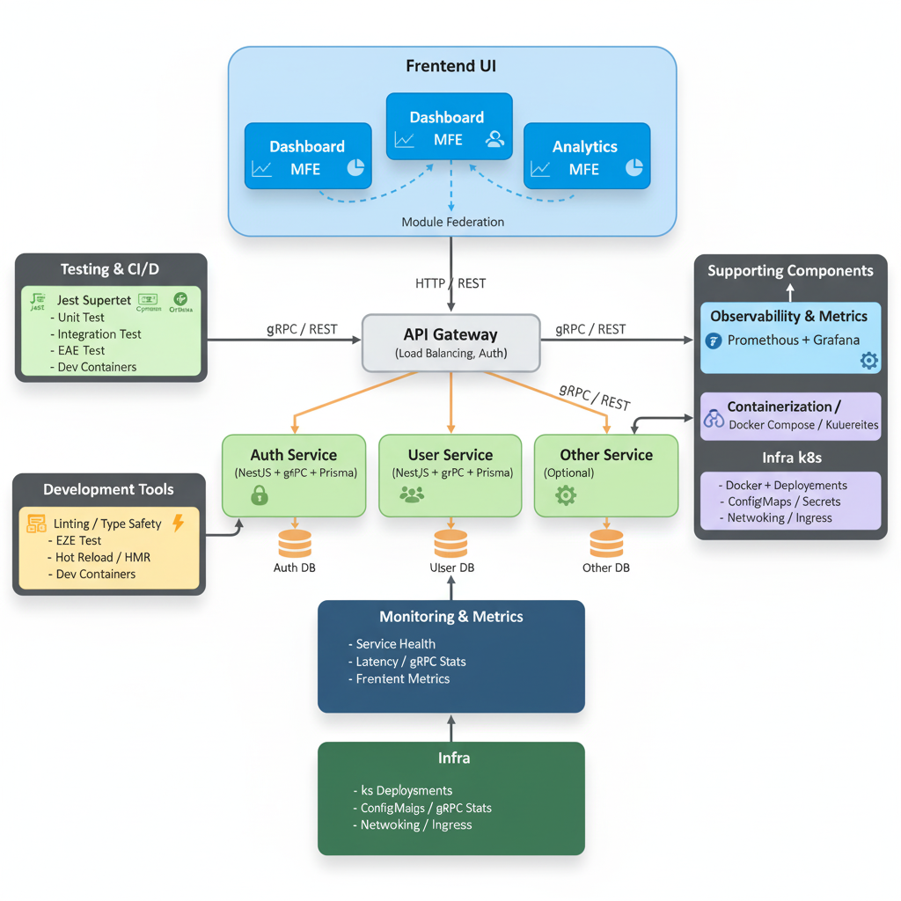

# FhyMatrix [EN](./README-EN.md)

FhyMatrix adalah kerangka arsitektur modern berbasis microservices dan micro frontend yang sepenuhnya cloud-native, modular, dan scalable. Dirancang untuk developer tunggal atau tim kecil yang ingin membangun sistem kompleks dengan efisiensi tinggi, performa real-time, dan kemampuan integrasi lintas platform.

FhyMatrix memfasilitasi pengembangan cepat, pemeliharaan mudah, testing otomatis, dan integrasi modern dengan ekosistem cloud serta layanan eksternal, termasuk AI/ML dan platform multi-tenant.

## Filosofi

FhyMatrix dibangun dengan prinsip “Decoupled But Connected”, di mana setiap layanan backend dan micro frontend berdiri sendiri, memungkinkan pengembangan, pengujian, dan deployment secara independen tanpa mengganggu sistem lain.

Dengan gRPC sebagai tulang punggung komunikasi, FhyMatrix memberikan latensi rendah, performa tinggi, dan kemampuan real-time untuk layanan yang saling berinteraksi. Containerisasi melalui Docker dan Kubernetes memastikan sistem siap produksi, mudah diskalakan, dan cloud-ready.

Struktur proyek yang modular, bersih, dan type-safe memungkinkan developer tunggal atau tim kecil mengelola sistem kompleks, memonitor performa melalui Prometheus dan Grafana, bereksperimen dengan integrasi teknologi canggih, serta melakukan unit dan integration testing secara terpusat.

FhyMatrix juga berfungsi sebagai laboratorium eksperimen dan portofolio, menampilkan keahlian dalam arsitektur microservices, micro frontend, observability, Module Federation, dan deployment modern.

## Kelebihan

- Modular & Skalabel.
- Kinerja Tinggi & Latensi Rendah.
- Cloud-Siap & dalam Kontainer.
- Observabilitas & Pemantauan.
- Tumpukan Modern.
- Pengujian Otomatis.
- Ramah Pengembang Tunggal.

## Cocok Digunakan Untuk

- Aplikasi Skala Besar.
- Aplikasi Real-Time.
- Eksperimen & Learning.
- Aplikasi Modular Terintegrasi.

## Fitur Bawaan

#### Backend Microservices

- Auth Service (NestJS + Prisma + gRPC)
- User Service (NestJS + Prisma + gRPC)
- Other Service (Opsional)
- API Gateway
- REST & gRPC endpoints
- Unit & Integration Testing

#### Frontend Micro Frontend

- Dashboard MFE
- Profile MFE
- Analytics MFE
- Modular & independent
- Module Federation untuk sharing komponen/state antar MFE
- Unit Testing

#### Infra & Observability

- Docker + Docker Compose
- Kubernetes deployment-ready
- Prometheus + Grafana
- Environment config per service dan MFE

#### Teknologi Digunakan

- Backend: Node.js, NestJS, Prisma, PostgreSQL, gRPC, Docker
- Frontend: React, Vite, Tailwind CSS, Module Federation
- Infra / DevOps: Docker Compose, Kubernetes, Prometheus, Grafana
- Testing: Jest

## Kesimpulan

> FhyMatrix adalah proyek future-ready yang menyatukan modularitas, performa tinggi, cloud-native, observability, dan testing otomatis, dirancang untuk solo developer atau tim kecil yang ingin membangun sistem kompleks dengan efisiensi, skalabilitas, dan teknologi cutting-edge.

## Diagram Arsitektur



```
                ┌─────────────────────────────────┐
                │             Frontend UI         │
                │                                 │
                │  ┌───────────────┐              │
                │  │ Dashboard MFE │◀┐            │
                │  └───────────────┘  │Modul      │
                │  ┌───────────────┐  │Federation │
                │  │ Profile MFE   │◀┘            │
                │  └───────────────┘              │
                │  ┌───────────────┐              │
                │  │ Analytics MFE │              │
                │  └───────────────┘              │
                └────────────────┬────────────────┘
                                 │ HTTP / REST
                                 ▼
                   ┌───────────────────────────┐
                   │        API Gateway        │
                   │  (Load Balancing, Auth)   │
                   └─────────────┬─────────────┘
                                 │ gRPC / REST
        ┌────────────────────────┼────────────────────────┐
        ▼                        ▼                        ▼
┌───────────────┐        ┌───────────────┐        ┌───────────────┐
│ Auth Service  │        │ User Service  │        │ Other Service │
│(NestJS + gRPC │        │(NestJS + gRPC │        │ (Optional)    │
│ + Prisma)     │        │ + Prisma)     │        │               │
└───────┬───────┘        └───────┬───────┘        └───────┬───────┘
        │ PostgreSQL / DB        │ PostgreSQL / DB        │ DB / Storage
        ▼                        ▼                        ▼
┌───────────────┐        ┌───────────────┐        ┌───────────────┐
│    Auth DB    │        │    User DB    │        │    Other D    │
└───────────────┘        └───────────────┘        └───────────────┘
        ▲
        │ Observability & Metrics
        │ Prometheus + Grafana
        │
┌────────────────────────────┐
│  Monitoring & Metrics      │
│  - Service Health          │
│  - Latency / gRPC Stats    │
│  - Frontend Metrics        │
└────────────────────────────┘
        ▲
        │ Containerization / Orchestration
        │ Docker + Docker Compose / Kubernetes
        │
┌────────────────────────────┐
│  Infra                     │
│  - k8s Deployments         │
│  - ConfigMaps / Secrets    │
│  - Networking / Ingress    │
└────────────────────────────┘
        ▲
        │ Testing & CI/CD
        │ Unit Test / Integration Test / E2E Test
        │ Jest / Supertest / Cypress
        │
┌────────────────────────────┐
│  Development Tools         │
│  - Linting / Type Safety   │
│  - Hot Reload / HMR        │
│  - Dev Containers          │
└────────────────────────────┘
```

## Folder Struktur

#### Backend

```
FhyMatrix-BE/
│
├── services/
│   ├── auth-service/
│   │   ├── proto/
│   │   │   └── auth.proto
│   │   ├── src/
│   │   │   ├── controllers/
│   │   │   │   └── authController.js
│   │   │   ├── models/
│   │   │   │   └── authModel.js
│   │   │   ├── routes/
│   │   │   │   └── authRoutes.js
│   │   │   ├── prisma/
│   │   │   │   └── schema.prisma
│   │   │   ├── config/
│   │   │   │   └── index.js
│   │   │   └── server.js
│   │   ├── tests/
│   │   │   └── authController.test.js
│   │   ├── package.json
│   │   ├── .env.example
│   │   └── Dockerfile
│   │
│   ├── user-service/
│   │   ├── proto/
│   │   │   └── user.proto
│   │   ├── src/
│   │   │   ├── controllers/
│   │   │   │   └── userController.js
│   │   │   ├── models/
│   │   │   │   └── userModel.js
│   │   │   ├── routes/
│   │   │   │   └── userRoutes.js
│   │   │   ├── prisma/
│   │   │   │   └── schema.prisma
│   │   │   ├── config/
│   │   │   │   └── index.js
│   │   │   └── server.js
│   │   ├── tests/
│   │   │   └── userController.test.js
│   │   ├── package.json
│   │   ├── .env.example
│   │   └── Dockerfile
│   │
│   └── other-service/
│       ├── proto/
│       │   └── other.proto
│       ├── src/
│       │   ├── controllers/
│       │   │   └── otherController.js
│       │   ├── models/
│       │   │   └── otherModel.js
│       │   ├── routes/
│       │   │   └── otherRoutes.js
│       │   ├── prisma/
│       │   │   └── schema.prisma
│       │   ├── config/
│       │   │   └── index.js
│       │   └── server.js
│       ├── tests/
│       │   └── otherController.test.js
│       ├── package.json
│       ├── .env.example
│       └── Dockerfile
│
├── gateway/
│   ├── src/
│   │   ├── services/
│   │   │   ├─── authService.js
│   │   │   ├─── otherService.js
│   │   │   └── userService.js
│   │   ├── utils/
│   │   │   └─── gprcHelper.js
│   │   └── server.js
│   ├── config/
│   │   └── index.js
│   ├── tests/
│   │   └── apiGateway.test.js
│   ├── package.json
│   ├── .env.example
│   └── Dockerfile
│
├── infra/
│   ├── k8s/
│   │   ├── auth-service-deployment.yaml
│   │   ├── user-service-deployment.yaml
│   │   ├── other-service-deployment.yaml
│   │   └── gateway-deployment.yaml
│   ├── prometheus/
│   │   └── prometheus.yaml
│   └── grafana/
│       └── dashboards/
│           ├── auth-service-dashboard.json
│           ├── user-service-dashboard.json
│           ├── gateway-dashboard.json
│           └── other-service-dashboard.json
│
├── package.json
└── docker-compose.yml
```

#### Frantend

```
FhyMatrix-FE/
│
├── mfe-dashboard/
│   ├── src/
│   │   ├── components/
│   │   │   └── UserCard.js
│   │   ├── pages/
│   │   │   └── App.js
│   │   ├── hooks/
│   │   │   └── useFetch.js
│   │   ├── services/
│   │   │   └── userService.js
│   │   └── index.js
│   ├── public/
│   │   └── index.html
│   ├── tests/
│   │   └── App.test.js
│   ├── package.json
│   ├── .env.example
│   └── Dockerfile
│
├── mfe-profile/
│   ├── src/
│   │   ├── components/
│   │   │   └── ProfileCard.js
│   │   ├── pages/
│   │   │   └── App.js
│   │   ├── hooks/
│   │   │   └── useProfile.js
│   │   ├── services/
│   │   │   └── profileService.js
│   │   └── index.js
│   ├── public/
│   │   └── index.html
│   ├── tests/
│   │   └── App.test.js
│   ├── package.json
│   ├── .env.example
│   └── Dockerfile
│
├── mfe-analytics/
│   ├── src/
│   │   ├── components/
│   │   │   └── Chart.js
│   │   ├── pages/
│   │   │   └── App.js
│   │   ├── hooks/
│   │   │   └── useAnalytics.js
│   │   ├── services/
│   │   │   └── analyticsService.js
│   │   └── index.js
│   ├── public/
│   │   └── index.html
│   ├── tests/
│   │   └── App.test.js
│   ├── package.json
│   ├── .env.example
│   └── Dockerfile
│
└── docker-compose.yml
```